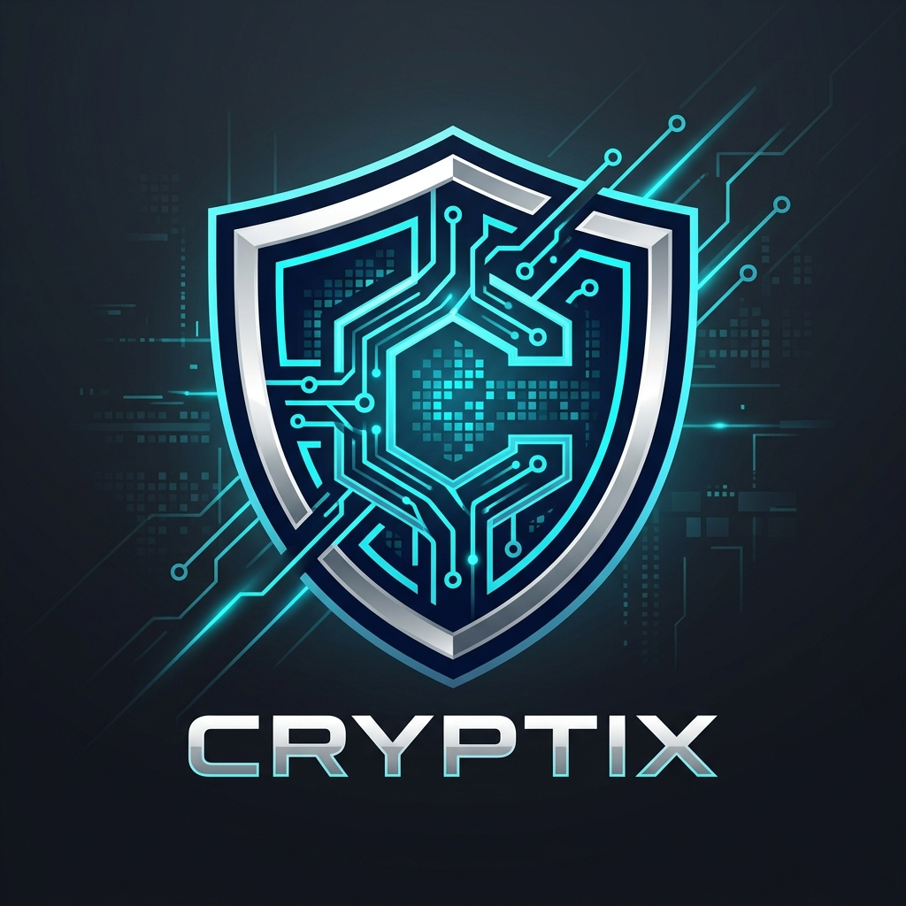
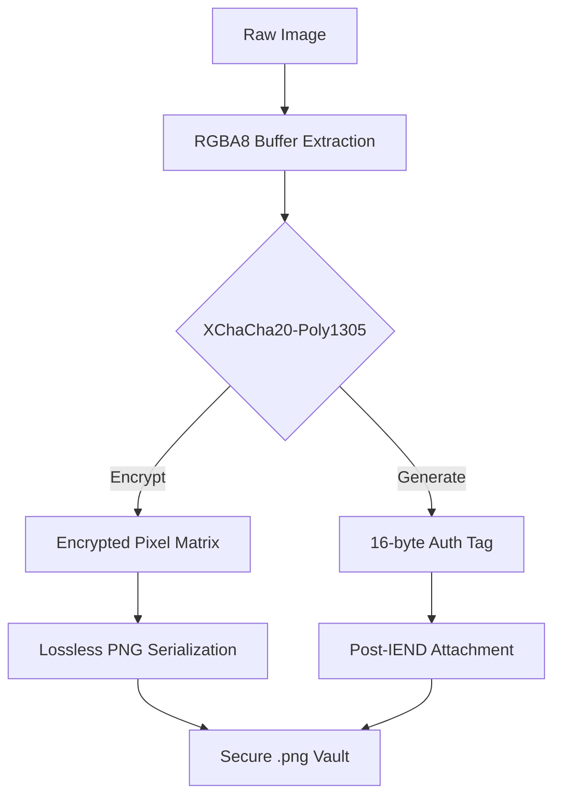

<p align="center">
  
</p>

# 🛡️ Cryptix
**The Apex of Interactive Visual Data Obfuscation**

[](https://www.rust-lang.org/)
[](https://en.wikipedia.org/wiki/ChaCha20-Poly1305)
[](LICENSE)
[]()

**Cryptix** is a high-performance, cryptographically hardened suite designed for the absolute sanitization of visual assets. By operating at the pixel-matrix level rather than the file-container level, Cryptix transforms raw image data into mathematically verified noise, rendering it invisible to forensic analysis without the unique polymorphic key bundle.

---

## 💎 State-of-the-Art Features

*   **Authenticated Encryption (AEAD)**: Powered by `XChaCha20-Poly1305`, providing not just privacy, but mathematical proof that your data has not been tampered with.
*   **Post-IEND Integrity Seal**: A custom 16-byte Poly1305 authentication tag is appended to the PNG byte stream, ensuring full tamper-detection while remaining invisible to standard image viewers.
*   **Zero-Trace Memory**: Utilizes the `zeroize` trait to perform secure memory scrubbing, ensuring that encryption keys never persist in RAM after a session ends.
*   **Smart TUI Interface**: A refined terminal experience featuring neon aesthetics, real-time progress tracking via `indicatif`, and intelligent multi-line key handling.
*   **Mobile-Ready Logic**: Native `Termux` clipboard integration and a robust multi-line paste reader for seamless cross-platform security.

---

## 🔬 Technical Comparison

| Feature | Standard Stream Ciphers | Cryptix (AEAD) |
| :--- | :---: | :---: |
| **Privacy (XOR)** | ✅ | ✅ |
| **Tamper Resistance** | ❌ | ✅ (Poly1305) |
| **Nonce Reuse Protection** | Limited | ✅ (192-bit X-Nonce) |
| **Integrity Checks** | Manual/External | ✅ Built-in |
| **Memory Security** | Manual | ✅ Automated `Zeroize` |

---

## 🛠️ Internal Architecture

Cryptix implements a multi-stage deterministic pipeline to ensure data remains lossless and verifiable.



### The Post-IEND Strategy
Standard encryption often corrupts file headers. Cryptix avoids this by:
1.  Encrypting only the raw pixel bytes.
2.  Saving the file as a valid, viewable (as noise) PNG.
3.  Appending the **Poly1305 Tag** at the very end of the file file (after the `IEND` chunk).
4.  Validating this tag during decryption; if a single bit is changed, the vault remains sealed.

---

## 🚀 Installation

### Prerequisites
*   [Rust Toolchain](https://rustup.rs/) (Stable)
*   Standard Build Tools (`gcc`, `make`, etc.)

### Build from Source
```bash
# Clone the repository
git clone https://github.com/hakinexus/cryptix.git
cd cryptix

# Build for production
cargo build --release
```
The optimized binary will be available at `./target/release/cryptix`.

---

## 🎮 Operational Guide

### 1. Launching the Suite
```bash
./target/release/cryptix
```

### 2. Encryption (Locking)
*   Select **◈ Target Image File** from the main menu.
*   Locate your source image (supports PNG, JPG, WebP).
*   Choose **🔒 Encrypt (Lock Data)**.
*   **Secure the Key Bundle**: The TUI will output a URL-safe Base64 bundle. Save this immediately.

### 3. Decryption (Unlocking)
*   Select the target `_locked.png` file.
*   Choose **🔓 Decrypt (Unlock Data)**.
*   Paste your key bundle. Cryptix will automatically verify the integrity seal before restoring the image.

---

## 🗺️ Roadmap
- [ ] **Batch Processing**: Parallel encryption of entire directory clusters.
- [ ] **Key File Sharding**: Splitting keys across multiple physical files.
- [ ] **Steganographic Tunneling**: Hiding encrypted data inside legitimate images.
- [ ] **Desktop GUI**: A native cross-platform interface built with Tauri.

---

## 📄 License
Distributed under the MIT License. See `LICENSE` for more information.

<p align="center">
  <b>Developed by hakinexus with 🦀 Rust for absolute security.</b>
</p>
